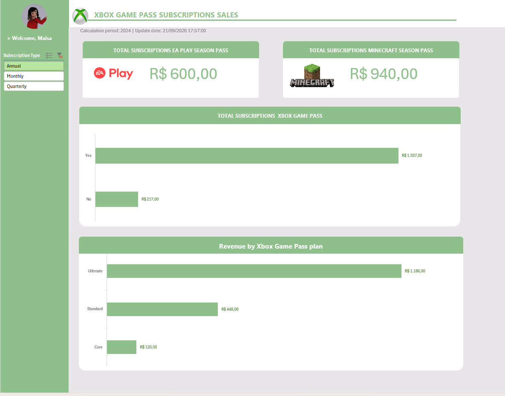

# 🎮 Dashboard de Vendas Xbox com excel

> 📊 Dashboard interativo desenvolvido em Excel para análise de assinaturas e faturamento do Xbox Game Pass, utilizando tabelas dinâmicas, gráficos dinâmicos e segmentação de dados.

---
## 📖 Sobre o projeto
 
O **Dashboard de Vendas Xbox com excel** foi desenvolvido durante o desafio **"Criando um Dashboard de Vendas do Xbox"**, da formação **Análise de Dados com Excel e IA** da **DIO (Digital Innovation One)**.

O projeto teve como objetivo transformar uma base de dados de assinaturas do Xbox Game Pass em um dashboard visual e interativo, permitindo analisar indicadores de vendas, faturamento e desempenho dos serviços adicionais oferecidos pela plataforma.

Além da proposta original do desafio, foram realizadas modificações, incluindo uma nova paleta de cores e a implementação de uma análise adicional de faturamento por tipo de plano, ampliando a capacidade analítica do dashboard.

---
## 🎯 Objetivo

O objetivo deste projeto é apresentar informações estratégicas sobre as vendas do Xbox Game Pass de forma clara, visual e interativa.
Através da utilização de recursos do Excel, o dashboard permite identificar padrões de receita, comportamento das assinaturas e desempenho dos produtos complementares.

---
## 🚀 Funcionalidades

- 📊 Dashboard interativo.
- 📌 Indicadores de faturamento.
- 🎮 Análise das assinaturas Xbox Game Pass.
- 🔄 Comparação entre assinaturas com e sem renovação automática.
- 🕹️ Monitoramento das vendas do EA Play Season Pass.
- ⛏️ Monitoramento das vendas do Minecraft Season Pass.
- 🎚️ Segmentação dinâmica por tipo de assinatura.
- 📈 Gráficos dinâmicos para visualização dos dados.
- 💰 Cálculo automático do faturamento total.
- 🎨 Personalização visual com paleta de cores própria.
- 📉 Comparação de receita por categoria de plano.
- 
---
## 📊 Indicadores analisados

O dashboard responde às seguintes perguntas de negócio:

### 1️⃣ Qual o faturamento total das vendas de planos anuais?
Análise do faturamento consolidado considerando todas as assinaturas agregadas.

### 2️⃣ Qual o faturamento total dos planos anuais por renovação automática?
Comparação entre clientes com:
- ✅ Auto Renewal = Yes
- ❌ Auto Renewal = No
- 

### 3️⃣ Qual o total de vendas do EA Play Season Pass?
Análise das vendas vinculadas ao serviço complementar EA Play.

### 4️⃣ Qual o total de vendas do Minecraft Season Pass?
Análise das vendas associadas ao complemento Minecraft Season Pass.

### 5️⃣ Qual plano do Xbox Game Pass gera maior faturamento?
Funcionalidade adicional implementada no projeto.
Comparação entre os planos:
- 🟢 Core
- 🟡 Standard
- 🟢 Ultimate
permitindo identificar qual categoria gera maior receita para o negócio. O resultado da análise demonstrou que o plano **Ultimate** possui o maior faturamento entre os planos disponíveis. 

---
## ⭐ Diferenciais do projeto

Além da implementação proposta pela DIO, o dashboard recebeu melhorias próprias:
- Nova identidade visual;
- Paleta de cores personalizada inspirada no ecossistema Xbox;
- Melhor organização dos elementos visuais;
- Inclusão de gráfico de faturamento por tipo de plano;
- Integração da nova análise com as segmentações de dados;
- Aprimoramento da experiência de navegação e interpretação dos indicadores. 
- 
---
## 🛠️ Tecnologias e recursos utilizados

- Microsoft Excel
- Tabelas Dinâmicas
- Gráficos Dinâmicos
- Segmentação de Dados (Slicers)
- Fórmulas de agregação
- Painel Dashboard
- Organização de Base de Dados
- Formatação Condicional
- Design de Dashboards
 
---
## 💻 Conceitos praticados

Durante o desenvolvimento do projeto foram aplicados conceitos de:

- Limpeza e organização de dados;
- Estruturação de base de dados;
- Modelagem para relatórios;
- Criação de Tabelas Dinâmicas;
- Construção de KPIs;
- Criação de Dashboards;
- Segmentação de dados;
- Análise exploratória;
- Visualização de dados;
- Storytelling com dados;
- Design aplicado a dashboards.

---
## 📸 Demonstração

---
## 📈 Principais Insights

Através das análises realizadas foi possível identificar:

- O faturamento total das assinaturas filtradas.
- O impacto da renovação automática sobre a receita.
- O desempenho dos serviços complementares EA Play e Minecraft.
- O plano Ultimate como principal gerador de receita entre os planos analisados. 
- 
---
## 📚 Aprendizados

Este projeto permitiu aprofundar conhecimentos em Excel aplicado à análise de dados e construção de dashboards.

Foram praticados conceitos importantes como criação de tabelas dinâmicas, construção de indicadores de desempenho, utilização de segmentações de dados e desenvolvimento de dashboards interativos.

Um dos principais aprendizados foi compreender como transformar uma base de dados bruta em informações úteis para tomada de decisão, utilizando visualizações que facilitam a interpretação dos resultados.

A implementação de uma análise adicional de faturamento por tipo de plano também contribuiu para desenvolver uma visão mais analítica e orientada a negócios.

---
## 👨‍🏫 Créditos

Projeto desenvolvido como exercício prático durante o desafio:

**"Criando um Dashboard de Vendas do Xbox"**
da formação **Análise de Dados com Excel e IA** da **DIO (Digital Innovation One)**.
🔗 **Acesse o desafio:**
[[Dashboard de Vendas Xbox Game Pass - DIO](oard-de-vendas-do-xbox/learning/fe577da7-de3e-4eba-b3e9-10b4fbbfa023](https://web.dio.me/project/criando-um-dashboard-de-vendas-do-xbox/learning/fe577da7-de3e-4eba-b3e9-10b4fbbfa023?back=/track/formacao-analise-de-dados-com-excel-e-ia&tab=undefined&moduleId=undefined)

> 💡 A personalização visual, reorganização do dashboard e implementação da análise de faturamento por tipo de plano foram desenvolvidas por mim como forma de expandir a proposta original do desafio. 

---
## 📄 Licença

Este projeto foi desenvolvido para fins de estudo, aprendizado e composição de portfólio.

---
## 🌐 Acesse o projeto

📊 **Dashboard de Vendas Xbox Game Pass**
 
O arquivo Excel está disponível neste repositório.

---
### 👩‍💻 Desenvolvido por Maisa Mendes

